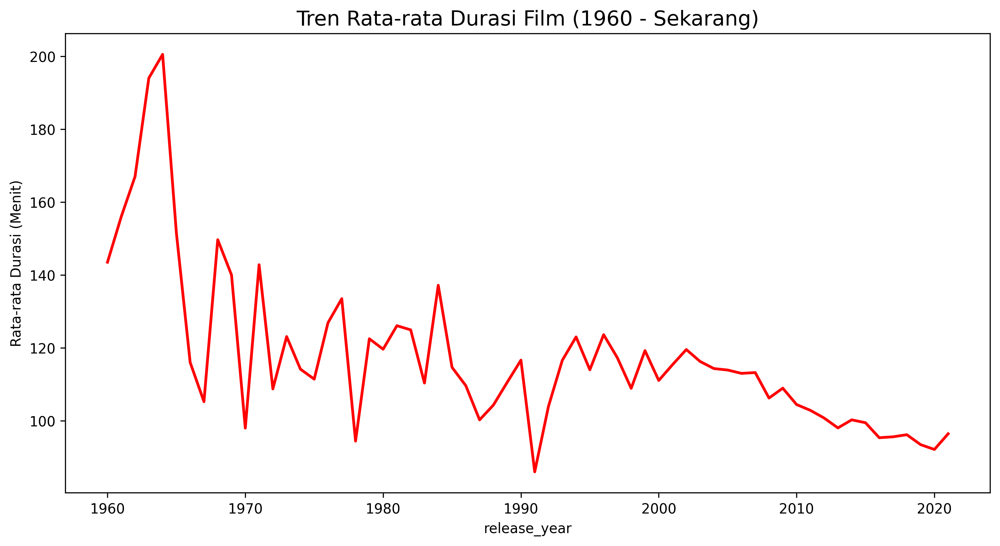
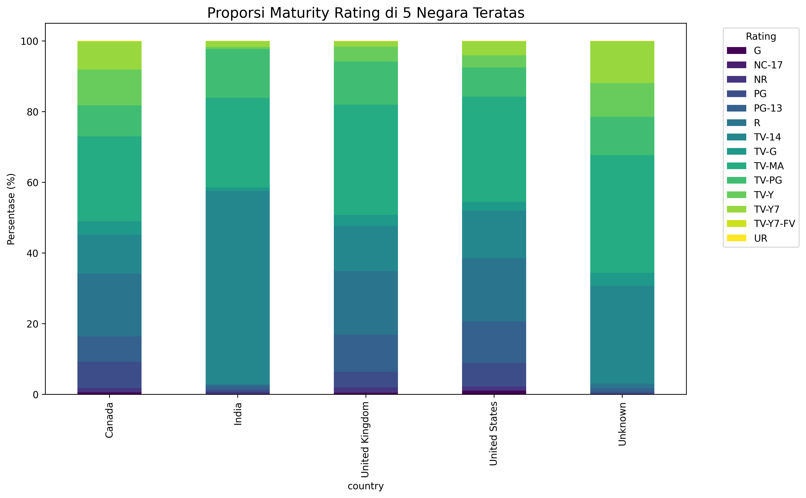

# 🎬 Netflix Global Content Strategy Analysis

## 📌 Project Overview
Proyek ini bertujuan untuk menganalisis library konten Netflix guna memahami strategi global platform dalam hal distribusi rating, tren durasi film, dan ekspansi konten internasional. Data yang digunakan mencakup daftar film dan acara TV yang tersedia hingga pertengahan tahun 2021.

## 📂 Data Source
Dataset yang digunakan dalam proyek ini bersumber dari Kaggle:
* **Dataset Name:** Netflix Movies and TV Shows
* **Author:** Shivam Bansal
* **Source Link:** [Netflix Dataset on Kaggle](https://www.kaggle.com/datasets/shivamb/netflix-shows)
* **Description:** Dataset ini terdiri dari daftar semua film dan acara TV yang tersedia di Netflix, lengkap dengan detail seperti pemeran, sutradara, rating, rilis tahun, dan durasi.

## 🚀 Key Insights
* **Strategi Lokalisasi India:** Berbeda dengan tren global yang didominasi konten dewasa (TV-MA), pasar India memiliki fokus kuat pada konten ramah keluarga (TV-G).
* **Evolusi Durasi:** Film modern (pasca-2000) menunjukkan konsistensi durasi di bawah 120 menit untuk menjaga retensi penonton di era streaming.
* **Dominasi Internasional:** Konten non-US (International Movies) menjadi tulang punggung pertumbuhan library Netflix dengan efisiensi biaya yang lebih baik.

## 🛠️ Tech Stack & Methodology
* **Language:** Python
* **Libraries:** Pandas (Data Cleaning), Matplotlib & Seaborn (Visualisasi), NumPy.
* **Key Techniques:**
    * Handling missing values dengan metode imputasi 'Unknown'.
    * Teknik `.explode()` untuk normalisasi data kolom multi-negara dan multi-genre.
    * Time-series analysis untuk melihat tren pertumbuhan tahunan.

## 📊 Visualizations
### 1. Tren Pertumbuhan Konten (2008 - 2021)

> Analisis menunjukkan lonjakan masif pada 2016-2017 dan pergeseran fokus ke stabilitas TV Shows setelah 2018.

### 2. Distribusi Rating: Global vs India

> Menunjukkan perbedaan budaya yang signifikan dalam konsumsi konten antara pasar Barat dan Asia Selatan.

## 💡 Business Recommendations
1. **Fokus Konten Keluarga di India:** Meningkatkan produksi lokal dengan rating TV-G/TV-PG.
2. **Standardisasi Durasi:** Mempertahankan durasi film di kisaran 90-110 menit untuk optimasi *watch time*.
3. **Global Sourcing:** Terus mendiversifikasi konten "International Movies" dari negara produktif seperti Korea Selatan dan Spanyol.

---
*Proyek ini diselesaikan sebagai bagian dari portofolio Data Analysis.*
